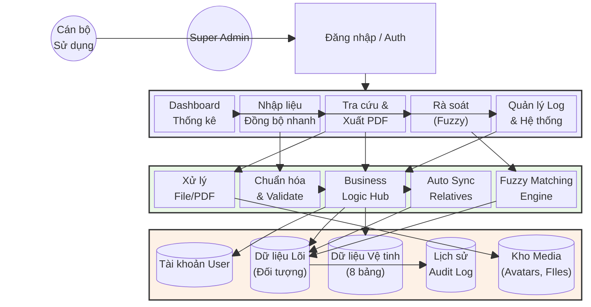

# MÔ TẢ CHI TIẾT DỰ ÁN (SECURITY PROFILE 360)

## 1. Giới thiệu chung
**Tên dự án:** Cơ sở dữ liệu về người Việt Nam có yếu tố nước ngoài (VCFE Database)
**Mục tiêu:** Số hóa, quản lý và khai thác hiệu quả hồ sơ đối tượng thuộc diện quản lý chuyên sâu (CSXH), đối tượng có yếu tố nước ngoài hoặc các diện đối tượng nghiệp vụ an ninh khác.

### Công nghệ sử dụng
- **Giao diện người dùng (Frontend):** Streamlit (Python) kết hợp Responsive Design, hỗ trợ Dark Mode và tùy biến giao diện.
- **Tiến trình xử lý (Backend):** Python (`services.py`, `auth.py`, `database.py`, `utils`).
- **Cơ sở dữ liệu (Database):** SQLite (`security_profile.db`) hỗ trợ mã hóa SQLCipherAES-256.
- **Thư viện cốt lõi:** `pandas` (xử lý dữ liệu lớn), `thefuzz`/`rapidfuzz` (thuật toán rà soát/so khớp mờ), `ECharts`/`Plotly` (vẽ biểu đồ trực quan), `fpdf` (xuất báo cáo PDF hồ sơ).
- **Đóng gói triển khai:** `pywebview`, `PyInstaller` để đóng gói dạng Desktop App (Portable).
- **Testing:** `pytest` (Unit testing framework).

---

## 2. CẤU TRÚC THƯ MỤC & TRÁCH NHIỆM MODULE
Dự án được tổ chức theo kiến trúc phân mảnh module nhằm dễ dàng bảo trì và mở rộng:

- `app/`: Thư mục gốc chứa các logic cấu hình nhỏ.
- `views/`: Chứa các module giao diện Streamlit cho từng chức năng.
    - `dashboard.py`: Trang tổng quan thống kê biểu đồ.
    - `nhap_lieu/`: Giao diện nhập liệu thủ công (có tích hợp tự động đồng bộ hồ sơ thân nhân).
    - `nhap_excel.py`: Chức năng nhập liệu hàng loạt từ Excel.
    - `tra_cuu.py`: Giao diện tra cứu chi tiết và quản lý hồ sơ 360 (bao gồm xuất PDF).
    - `ra_soat.py`: Chức năng so khớp dữ liệu mờ.
    - `audit_log.py`: Giao diện quản lý hệ thống, xem lịch sử thao tác.
- `utils/`: Các công cụ hỗ trợ lõi.
    - `pdf_export.py`: Module xuất hồ sơ đối tượng định dạng PDF chuyên nghiệp.
    - Các file xử lý định dạng văn bản, xử lý ảnh.
- `scripts/`: Phục vụ tự động hóa và DevOps.
    - `backup_db.py`: Script tự động sao lưu database (nén ZIP, giữ 7 ngày).
- `tests/`: Bộ Unit Tests sử dụng `pytest`.
    - `test_services_pytest.py`/`test_auth_service.py`: Phủ test cases các dịch vụ.
- `docs/`: Tài liệu kỹ thuật.
    - `SQLCIPHER_SETUP.md`: Hướng dẫn mã hóa database.
- `app.py`: Điểm đầu vào (entry-point) chạy giao diện Streamlit chính.
- `run_app.py`: Script khởi chạy cho phiên bản Desktop App.
- `database.py`: Thực thi các truy vấn và giao tiếp với SQLite.
- `services.py`: Tầng Business Logic xử lý nghiệp vụ, trung gian giữa `views` và `database.py`.
- `constants.py`: Từ điển/hệ thống các danh mục chuẩn.
- `build_portable.ps1`/`build_portable.bat`: Kịch bản biên dịch Desktop App.

---

## 3. KIẾN TRÚC DỮ LIỆU "PROFILE 360 ĐỘ"
Điểm lõi của hệ thống là xoay quanh **Số Cá nhân/CCCD**, phân nhánh ra một mạng lưới thông tin 8 chiều:

### Sơ đồ quan hệ vệ tinh
1. **doi_tuong (Bảng Lõi):** Căn cước, định danh, họ tên, tuổi, địa chỉ, ảnh chân dung, thông tin nghề nghiệp.
2. **lien_he:** SĐT, Email, Facebook, Zalo, Telegram.
3. **tai_chinh:** Danh sách tài khoản ngân hàng, ví điện tử liên kết.
4. **phuong_tien:** Biển kiểm soát xe máy, ô tô và thông tin phương tiện.
5. **nhan_than:** Mối quan hệ phả hệ (bố, mẹ, vợ chồng, con cái) có cơ chế **đồng bộ tự động sinh hồ sơ** (Synchronizing Relative Profiles) khi nhập mới.
6. **ho_so_dac_thu:** Nhóm đặc thù CSXH, làm việc cho chuyên gia nước ngoài, yếu tố kết hôn có yếu tố nước ngoài...
7. **qua_trinh_hoat_dong:** Dòng thời gian (Timeline) di biến động liên tục.
8. **tai_lieu:** Kho quản lý tài liệu vật lý scan/chụp đính kèm liên quan đối tượng.

---

## 4. QUY TRÌNH & TÍNH NĂNG NỔI BẬT CHÍNH
- **Giao diện đa nền tảng tối ưu (Dark Mode, High Contrast):** Điều hướng linh hoạt qua Sidebar trực quan (Navigation Highlighting chuẩn xác).
- **Xuất hồ sơ trung tâm ra PDF (PDF Exporting):** Module trích xuất toàn bộ Profile 360 (bao gồm ảnh chân dung, cấu hình Unicode tiếng Việt) ra tệp PDF chuẩn hóa để in ấn báo cáo.
- **Tự động đồng bộ hóa hồ sơ (Auto-sync Profile):** Thêm mới một thân nhân từ dạng vệ tinh sẽ có tuỳ chọn tự động tạo một thực thể đối tượng độc lập trong bảng lõi, giữ tính liên kết liền mạch.
- **Dashboard trực quan (Echarts/Plotly):** Tự động tổng hợp dữ liệu, báo cáo xu hướng, phân loại đối tượng chuyên sâu theo địa bàn.
- **Rà soát danh sách mờ (Fuzzy Matching):** Thuật toán chuyên biệt để nhận dạng các nhóm người "có thể trùng" nhưng bị sai lệch tiếng Việt, lỗi đánh máy, thứ tự chữ hay sai lệch dấu.
- **Hệ thống phân quyền & Audit Log (Tracking):**
    - Quyền kiểm soát truy cập dựa trên Roles (Role-based Access Control).
    - Mọi thao tác DML (Thêm, Sửa, Xóa) đều được tracking lại dấu vết nhằm bảo vệ tính toàn vẹn hệ thống.
- **Desktop Portable Architecture:**
    - Hoạt động Native Window không cần mở thủ công bằng Web Browser thông qua Pywebview.
    - Script khóa ngầm terminal VBScript giúp trải nghiệm chuyên nghiệp, an toàn tuyệt đối.
- **An toàn – Bảo mật CSDL:** Chế độ sao lưu tự động (Backup Retention 7 ngày), hỗ trợ bọc lõi database bằng mã hóa cấp quân sự (SQLCipher AES-256).

---

## 5. SƠ ĐỒ LUỒNG XỬ LÝ ĐA NHIỆM (PROCESSING FLOW)

---

## 6. HƯỚNG DẪN ĐÓNG GÓI & TRIỂN KHAI CHO END-USER
Hệ thống cho phép đóng gói thành dạng ứng dụng Portable để người dùng có thể mở nhanh ngay trên máy tính mà không cần setup môi trường mạng LAN/Server:

1. **Biên dịch & Build Cốt Lõi:** Khởi chạy tập lệnh `build_portable.ps1` (Powershell) hoặc `build_portable.bat`. Hệ thống sẽ tự động dùng PyInstaller đóng gói độc lập phân vùng tài nguyên trong mục `/dist_vX`.
2. **Khởi chạy Cửa sổ Desktop:** Kích đúp vào `1. Khoi_Dong.vbs`. 
     * Hệ thống tự động triệt tiêu và ẩn Command Prompt Terminal.
     * App xuất hiện trực tiếp mượt mà bằng Window UI Native.
3. **Thoát Chuẩn:** Sử dụng `2. Tat_He_Thong.vbs` để đóng mọi tiến trình phụ, ngăn ngừa xung đột Process Python ngầm.
4. **Bảo trì:** 
     * Khuyến nghị dùng `scripts/backup_db.py --install-task` đẩy vào hệ thống Windows Task Scheduler chạy lúc rảnh (ví dụ 02:00 AM).
     * Test tự động sau fix code bằng lệnh: `pytest tests/ -v`.
     * Áp dụng khóa file DB bằng SQLCipher trên máy cá nhân (`docs/SQLCIPHER_SETUP.md`) để giới hạn truy cập trực tiếp bằng các công cụ như DBeaver hay SQLiteStudio.
