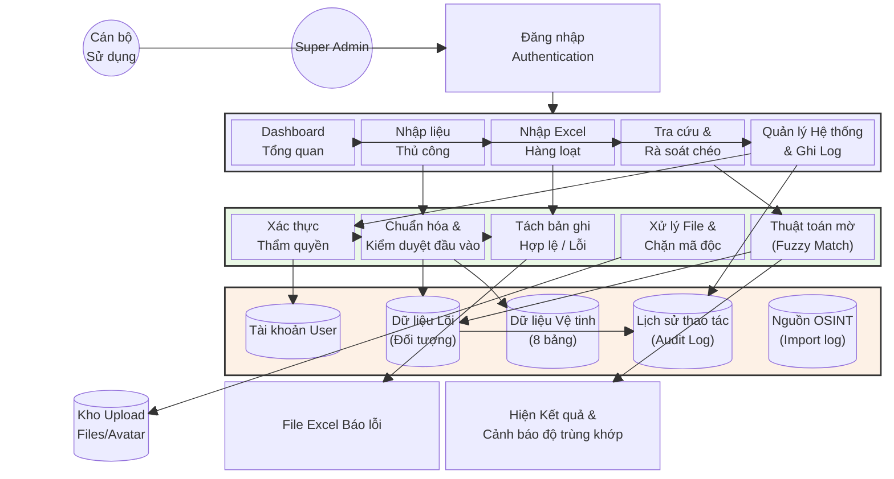

# MÔ TẢ CHI TIẾT DỰ ÁN (SECURITY PROFILE 360)

## 1. Giới thiệu chung
**Tên dự án:** Hệ thống Quản trị An ninh PA01 (Security Profile 360)
**Mục tiêu:** Số hóa, quản lý và khai thác hiệu quả hồ sơ đối tượng thuộc diện quản lý chuyên sâu (CSXH), đối tượng có yếu tố nước ngoài hoặc các diện đối tượng nghiệp vụ an ninh khác.

### Công nghệ sử dụng
- **Giao diện người dùng (Frontend):** Streamlit (Python).
- **Tiến trình xử lý (Backend):** Python (`services.py`, `auth.py`, `database.py`, `utils`).
- **Cơ sở dữ liệu (Database):** SQLite (`security_profile.db`) với hỗ trợ SQLAlchemy.
- **Thư viện cốt lõi:** `pandas` (xử lý dữ liệu lớn), `thefuzz`/`rapidfuzz` (thuật toán rà soát/so khớp mờ), `ECharts`/`Plotly` (vẽ biểu đồ trực quan).
- **Testing:** `pytest` (Unit testing framework).

---

## 2. CẤU TRÚC THƯ MỤC & TRÁCH NHIỆM MODULE
Dự án được tổ chức theo mô hình phân lớp rõ ràng:

- `app/`: Chứa logic lõi của ứng dụng.
    - `core/`: Các cấu hình hệ thống.
    - `db/`: Cấu hình kết nối cơ sở dữ liệu (SQLAlchemy).
    - `models/`: Định nghĩa các bảng dữ liệu bằng lớp Python (ORM).
    - `services/`: Các dịch vụ xử lý logic (Xác thực, nghiệp vụ).
- `views/`: Chứa các tệp giao diện Streamlit cho từng chức năng.
    - `dashboard.py`: Trang tổng quan thống kê.
    - `nhap_lieu/`: Giao diện nhập liệu thủ công.
    - `nhap_excel.py`: Chức năng nhập liệu hàng loạt từ Excel.
    - `ra_soat.py`: Chức năng so khớp dữ liệu mờ.
    - `audit_log.py`: Giao diện xem lịch sử thao tác.
- `utils/`: Các công cụ hỗ trợ (Xử lý văn bản, bảo mật, so khớp mờ).
- `scripts/`: Các script DevOps.
    - `backup_db.py`: Script tự động sao lưu database (nén ZIP, giữ 7 ngày).
- `tests/`: Bộ Unit Tests (pytest).
    - `test_services_pytest.py`: 30 tests cho lớp services.
    - `test_auth_service.py`: 24 tests cho module xác thực.
- `docs/`: Tài liệu kỹ thuật.
    - `SQLCIPHER_SETUP.md`: Hướng dẫn mã hóa database bằng SQLCipher.
- `app.py`: Tệp chạy chính (Main Entry point).
- `database.py`: Quản lý schema và các truy vấn SQLite trực tiếp.
- `constants.py`: Chứa các danh mục chuẩn (xã phường, nghề nghiệp, quốc gia...).

---

## 3. KIẾN TRÚC DỮ LIỆU "PROFILE 360 ĐỘ"
Điểm lõi của hệ thống là xoay quanh **Số Định danh cá nhân (CCCD)**, tạo ra một mạng lưới thông tin vệ tinh bao gồm 8 nhóm dữ liệu chính:

### Sơ đồ quan hệ thực thể (ERD)
1. **doi_tuong (Bảng Lõi):** Lưu trữ định danh, tên, tuổi, địa chỉ, ảnh.
2. **lien_he:** SĐT, Email, FB, Zalo, Telegram... (Quan hệ 1-N).
3. **tai_chinh:** Danh sách tài khoản ngân hàng, ví điện tử.
4. **phuong_tien:** Xe máy, ô tô, biển kiểm soát.
5. **nhan_than:** Quan hệ gia đình, bố mẹ, vợ chồng.
6. **ho_so_dac_thu:** Các yếu tố nghiệp vụ (Kết hôn NN, làm việc NGO/FDI...).
7. **qua_trinh_hoat_dong:** Dòng thời gian (Timeline) di biến động của đối tượng.
8. **tai_lieu:** Các tệp tin đính kèm (Scan, báo cáo, ảnh).

---

## 4. CÁC TÍNH NĂNG NỔI BẬT
- **Dashboard trực quan:** Tự động tổng hợp số liệu theo đơn vị hành chính và loại hình đối tượng.
- **Nhập liệu Excel thông minh:** Tự động kiểm tra tính hợp lệ của CCCD, định dạng ngày tháng, lọc trùng và báo cáo lỗi chi tiết bằng file Excel trả về.
- **Rà soát danh sách mờ (Fuzzy Matching):** Cho phép tìm kiếm đối tượng ngay cả khi thông tin không chính xác 100% (sai lệch dấu, viết tắt...).
- **Bảo mật & Phân quyền:**
    - Phân quyền theo vai trò (Admin/User).
    - Lưu vết (Audit Trail) mọi hành động: Xem, Thêm, Sửa, Xóa.
    - Chống các lỗ hổng Path Traversal khi upload/download file.
- **Sao lưu tự động (Backup):**
    - Script `scripts/backup_db.py` sao lưu database hàng ngày.
    - Nén ZIP, giữ lại 7 ngày gần nhất, kiểm tra integrity trước khi backup.
    - Hỗ trợ cài đặt Windows Task Scheduler tự động chạy lúc 02:00.
- **Unit Testing (pytest):**
    - 54 test cases bao phủ các hàm CRUD quan trọng trong `services.py` và xác thực trong `auth_service.py`.
    - Dùng in-memory SQLite + Mock để test không ảnh hưởng dữ liệu thật.
- **Hỗ trợ mã hóa Database (SQLCipher):**
    - Tài liệu hướng dẫn tại `docs/SQLCIPHER_SETUP.md`.
    - Mã hóa AES-256 toàn bộ file `.db` ở mức database, phục vụ triển khai portable trên laptop.

---

## 5. SƠ ĐỒ LUỒNG XỬ LÝ (PROCESSING FLOW DIAGRAM)

---

## 6. HƯỚNG DẪN ĐÓNG GÓI & TRIỂN KHAI (PORTABLE VERSION)
Hệ thống hỗ trợ đóng gói thành tệp thực thi duy nhất để chạy không cần cài đặt môi trường:

1. **Đóng gói:** Sử dụng script `build_portable.ps1` hoặc `build_portable.bat` để tạo bản phân phối qua PyInstaller/PyArmor.
2. **Khởi động:** Sử dụng `1. Khoi_Dong.vbs` để chạy ứng dụng trong chế độ ẩn terminal, giao diện được hiển thị qua cửa sổ Webview.
3. **Tắt hệ thống:** Sử dụng `2. Tat_He_Thong.vbs` để đóng hoàn toàn các tiến trình backend và frontend.
4. **Cơ sở dữ liệu:** File `security_profile.db` đi kèm trong thư mục gốc chứa toàn bộ dữ liệu.
5. **Sao lưu dữ liệu:** Chạy `python scripts/backup_db.py` để tạo bản backup nén ZIP. Dùng `--install-task` để cài đặt tự động hàng ngày.
6. **Mã hóa Database (Tùy chọn):** Tham khảo `docs/SQLCIPHER_SETUP.md` để mã hóa toàn bộ file `.db` bằng SQLCipher (AES-256), đặc biệt quan trọng khi triển khai portable trên laptop.
7. **Chạy Unit Tests:** `pytest tests/ -v` để kiểm tra tính toàn vẹn code sau khi cập nhật.
