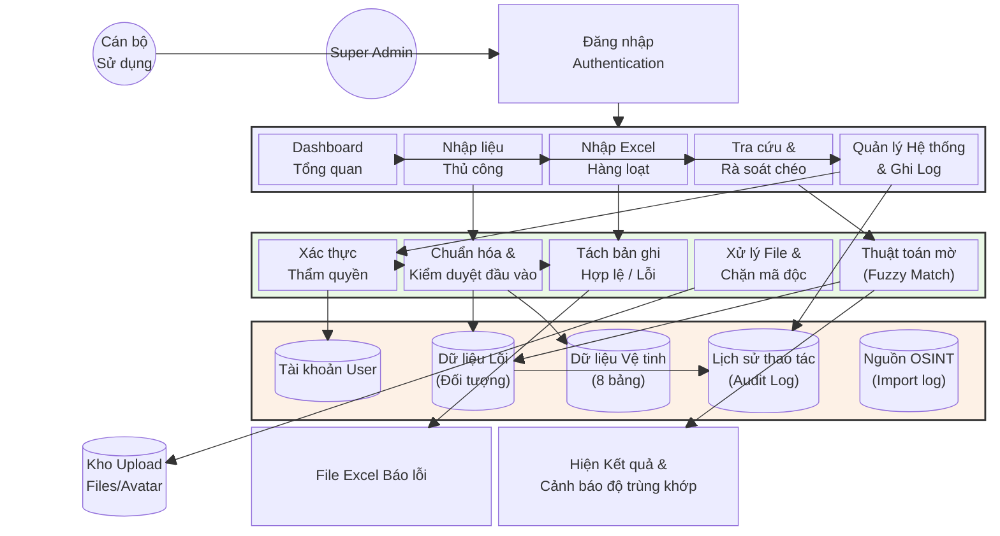

# MÔ TẢ CHI TIẾT DỰ ÁN (SECURITY PROFILE 360)

## 1. Giới thiệu chung
**Tên dự án:** Hệ thống Quản trị An ninh PA01 (Security Profile 360)
**Mục tiêu:** Số hóa, quản lý và khai thác hiệu quả hồ sơ đối tượng thuộc diện quản lý chuyên sâu (CSXH), đối tượng có yếu tố nước ngoài hoặc các diện đối tượng nghiệp vụ an ninh khác.

### Công nghệ sử dụng
- **Giao diện người dùng (Frontend):** Streamlit (Python).
- **Tiến trình xử lý (Backend):** Python (`services.py`, `auth.py`, `database.py`, `utils`).
- **Cơ sở dữ liệu (Database):** SQLite (`security_profile.db`).
- **Thư viện cốt lõi:** `pandas` (xử lý dữ liệu lớn), `thefuzz`/`rapidfuzz` (thuật toán rà soát/so khớp mờ), `ECharts`/`Plotly` (vẽ biểu đồ trực quan).

### Kiến trúc Dữ liệu "Profile 360 độ"
Điểm lõi của hệ thống là xoay quanh **Số Định danh cá nhân (CCCD)**, tạo ra một mạng lưới thông tin vệ tinh bao gồm 8 nhóm dữ liệu:
1. **Thông tin gốc (Đối tượng):** Tên, năm sinh, quê quán, nghề nghiệp, ảnh chân dung.
2. **Thông tin Liên hệ:** Số điện thoại, Email, Mạng xã hội.
3. **Tài chính:** Tài khoản ngân hàng, ví điện tử.
4. **Phương tiện:** Các phương tiện đăng ký.
5. **Nhân thân:** Quan hệ gia đình, thân nhân.
6. **Hồ sơ Đặc thù:** Các yếu tố nghiệp vụ CSXH.
7. **Quá trình hoạt động:** Dòng thời gian (Timeline) theo dõi di biến động.
8. **Tài liệu đính kèm:** Hồ sơ chứng cứ, tài liệu scan.

### Các tính năng Đột phá & An toàn
- **Dashboard trực quan:** Thống kê theo xã/phường, nhóm đối tượng thông qua biểu đồ tự động.
- **Nhập liệu & Xử lý Excel thông minh (Smart Bulk Import):** Quản lý đầu vào qua Upload Excel hàng nghìn dòng. Lọc lỗi thông minh.
- **Rà soát danh sách chéo bằng So khớp mờ (Fuzzy Matching):** So khớp tương đối, không yêu cầu khớp 100%.
- **Bảo mật Nội bộ & Phân quyền (Audit Trails & RBAC):** Phân quyền Super Admin / User, nhật ký lưu vết mọi thao tác (Audit Log), chống Path Traversal.

---

## 2. SƠ ĐỒ LUỒNG XỬ LÝ (PROCESSING FLOW DIAGRAM)
Hệ thống xử lý phân tầng rõ ràng từ Frontend (Giao diện người dùng) -> Backend (Xử lý Python) -> Database (SQLite).

